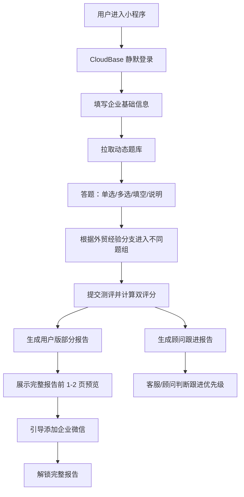

# 深度未来 — 企业出海测评小程序

> 用途：离职交接、简历编写、面试复盘。  
> 整理日期：2026-06-18。  
> 事实来源：当前仓库代码、`云帆Agent_项目里程碑.md`、`docs/backend-architecture-analysis.md`、`企业出海测评小程序开发文档.md`、`企业出海测评小程序开发分工文档.md`、`API_CONTRACT.md`、Git 提交记录。  
> 说明：未在仓库或文档中明确记录的数据量、并发量、性能提升百分比，本文统一标记为“未记录精确量化数据”，不做夸大。

## 目录

- [业务](#业务)
- [技术架构](#技术架构)
- [踩坑记录](#踩坑记录)
- [亮点提炼](#亮点提炼)
- [简历素材](#简历素材)

## 业务

### 项目定位

“深度未来”是一款基于微信小程序和 CloudBase 云开发的企业出海测评工具。项目目标不是单纯做“短视频出海测评”，而是先判断企业出海可行性、用户意愿和跟进价值，再在适合的情况下推荐短视频获客、私域承接或其他出海路径。

核心业务目标有三点：

1. 激活私域用户，让潜在客户愿意完成一次 20-30 分钟的企业出海诊断。
2. 生成企业出海评估报告，帮助用户理解行业机会、企业优势、短板、推荐路径和行动计划。
3. 筛选高价值 1v1 线索，让客服/顾问能基于顾问跟进评分和销售线索报告判断是否优先跟进。

### 用户角色

| 角色 | 主要目标 | 可见数据 |
|---|---|---|
| 普通用户 | 完成测评、查看部分报告、添加客服后解锁完整报告 | 企业出海评分、用户版报告、部分完整报告预览 |
| 客服/顾问 | 查看线索、判断意向、跟进客户 | 用户基础信息、答题结果、企业出海评分、顾问跟进评分、顾问跟进报告 |
| 管理员 | 配置系统、管理顾问、查看运行数据 | 系统配置、客服二维码、测评数据、顾问端数据 |

### 主业务流程



### 核心功能模块

| 模块 | 业务价值 | 当前状态 |
|---|---|---|
| 微信登录 | 用 OpenID 建立用户身份，避免前端伪造用户 | M2 已完成 |
| 企业基础信息 | 记录公司、行业、产品、目标市场、外贸经验等关键上下文 | M1/M2 已完成基础校验，当前为兼容前端暂可选 |
| 动态题库 | 支持数据库配置题目，避免硬编码题流 | M2 已完成读取与分支归类 |
| 双评分系统 | 企业出海评分面向用户，顾问跟进评分面向销售 | 基础逻辑已存在，后续需按完整题库调整权重 |
| 报告生成 | 用户版报告 + 顾问线索报告 | 现阶段以模板报告为主，AI 生成仍是后续 M5 |
| 解锁机制 | 从留资解锁转为添加企业微信后解锁完整报告 | 基础链路已实现，真实企微/SCRM 回调仍待接入 |
| 顾问端 | 顾问查看线索、报告、备注与跟进状态 | 规划中，部分接口待开发 |

## 技术架构

### 架构演进

项目历史上存在两套后端：

| 阶段 | 技术栈 | 状态 | 说明 |
|---|---|---|---|
| V1/V2 历史后端 | FastAPI + SQLAlchemy + SQLite/MySQL + JWT + DeepSeek Prompt | 保留参考 | 曾用于 15/18 题测评、AI 报告、企微解锁等逻辑验证 |
| 当前主线 | 微信小程序 + CloudBase 云函数 + Node.js + CloudBase NoSQL | 当前使用 | 解决手机预览访问本地 127.0.0.1、微信登录、部署复杂度问题 |

当前 CloudBase 环境：

```text
cloud1-d8gh82s3a39eff92d
```

小程序 AppID：

```text
wx7ed6bdb5ed913fa9
```

### 当前目录职责

```text
cloudfunctions/
├── shared/                    # 云函数共享模块源文件
│   ├── db.js                  # CloudBase 初始化、db、上下文、时间工具
│   ├── response.js            # 统一响应格式
│   ├── basicInfo.js           # 企业基础信息强校验
│   ├── questionModel.js       # 题目结构归一化
│   ├── questionFlow.js        # 动态题库读取与分支聚合
│   ├── scoring.js             # 企业出海评分、顾问跟进评分
│   ├── reportTemplate.js      # 模板报告
│   └── __tests__/             # 共享模块测试
├── login/                     # 静默登录
├── getAssessmentConfig/       # 获取题库与评分配置
├── createAssessment/          # 创建测评
├── submitAnswer/              # 提交答案
├── completeAssessment/        # 完成测评并算分
├── getReportList/             # 我的报告列表
├── getReportDetail/           # 报告详情
└── ...                        # 企微解锁、系统配置等云函数

miniprogram/
├── app.js                     # wx.cloud 初始化
├── utils/cloudApi.js          # wx.cloud.callFunction 封装
└── pages/                     # 用户端页面
```

### 云数据库集合

| 集合 | 用途 | 关键字段 |
|---|---|---|
| `users` | 用户身份与基础信息 | `openid`, `unionid`, `role`, `basicInfo`, `lastLoginAt` |
| `assessments` | 测评主记录 | `openid`, `basicInfo`, `status`, `branch`, `feasibility_score`, `lead_score`, `is_unlocked` |
| `answers` | 答案明细 | `assessment_id`, `question_id`, `question_type`, `value`, `score_detail` |
| `questions` | 动态题库 | `question_id`, `title`, `description`, `dimension`, `branch`, `type`, `options`, `sort_order`, `is_active` |
| `reports` | 用户报告 | `assessment_id`, `report_json`, `is_unlocked`, `generation_status` |
| `lead_reports` | 顾问跟进报告 | `assessment_id`, `lead_score`, `lead_priority`, `followup_focus`, `opening_script` |
| `system_config` | 全局系统配置 | `_id: global_config`, `wecom_qr_url`, `ai_report_enabled`, `benefit_minutes_default` |
| `consultant_notes` | 顾问跟进记录 | `assessment_id`, `status`, `remark`, `updated_at` |
| `wecom_unlock_sessions` | 企微解锁会话 | `assessment_id`, `report_id`, `status`, `expires_at` |

### 索引与查询优化

已通过 CloudBase 管理能力补齐的关键索引包括：

| 集合 | 索引 | 目的 |
|---|---|---|
| `questions` | `uniq_question_id` | 防止题号重复 |
| `questions` | `idx_active_branch_sort` | 按启用状态、分支、排序号稳定拉取题目 |
| `assessments` | `idx_openid_created_at` | 支持“我的报告/测评列表”按用户和时间查询 |
| `assessments` | `idx_openid_status` | 支持按用户和测评状态过滤 |
| `consultant_notes` | `uniq_assessment_id` | 一个测评对应一条顾问跟进记录 |
| `consultant_notes` | `idx_status_updated_at` | 支持顾问端按状态和更新时间筛选 |

### 统一响应契约

所有云函数统一返回：

```js
function success(data) {
  return {
    success: true,
    data: data || {},
  };
}

function fail(errorCode, errorMessage) {
  return {
    success: false,
    errorCode,
    errorMessage,
  };
}
```

这解决了前端需要同时兼容 `ok/error`、HTTP 状态码、云函数异常对象的问题。前端只需要判断 `success`，失败时读取 `errorCode` 与 `errorMessage`。

### 身份与权限边界

当前后端不信任前端传入的 `openid`，所有用户身份都在云函数内部获取：

```js
exports.main = async () => {
  const { OPENID, UNIONID } = getContext();

  if (!OPENID) {
    return fail("UNAUTHORIZED", "未获取到用户身份，请重新进入小程序");
  }

  // 后续数据库查询和写入均绑定 OPENID，避免前端伪造用户身份。
};
```

这个设计解决了本地 HTTP + JWT 在小程序预览环境中的复杂性，也减少了越权访问风险。

### 企业基础信息强校验

```js
function validateBasicInfo(rawBasicInfo) {
  assertObject(rawBasicInfo, "basicInfo");

  const basicInfo = {};
  REQUIRED_STRING_FIELDS.forEach((field) => {
    // 字符串字段统一 trim，并拒绝空值和超长值。
    basicInfo[field] = normalizeRequiredString(rawBasicInfo[field], field);
  });
  REQUIRED_ARRAY_FIELDS.forEach((field) => {
    // 区域和目标市场必须是数组，便于后续报告和筛选稳定使用。
    basicInfo[field] = normalizeStringArray(rawBasicInfo[field], field);
  });

  if (typeof rawBasicInfo.hasForeignTradeExperience !== "boolean") {
    throw new Error("hasForeignTradeExperience必须是布尔值");
  }
  basicInfo.hasForeignTradeExperience = rawBasicInfo.hasForeignTradeExperience;

  return basicInfo;
}
```

这段逻辑把前端容易传错的字段，例如字符串数组、布尔值、空字符串，统一挡在云函数入口，避免脏数据进入 `assessments` 集合。

### 动态题库读取

```js
async function loadActiveQuestions(db) {
  const result = await db.collection("questions")
    .where({ is_active: true })
    .orderBy("sort_order", "asc")
    .get();

  // normalizeQuestion 负责将数据库中的题目归一化为前端稳定结构。
  return (result.data || []).map(normalizeQuestion);
}

async function getQuestionsForBranch(db, branch, options) {
  const allQuestions = await loadActiveQuestions(db);
  const grouped = splitQuestionsByBranch(allQuestions, branch);
  if (options && options.legacy) {
    return grouped.questions.map(toLegacyQuestion);
  }
  return grouped;
}
```

题库从硬编码数组迁移为数据库驱动后，后续修改题目、排序、分支、选项分值，不需要重新改前端代码。

### 当前验证方式

已有本地 Node 级别校验与共享模块测试：

```bash
find cloudfunctions miniprogram -name "*.js" -maxdepth 5 -print | sort | xargs -I{} node --check {}
node cloudfunctions/shared/__tests__/shared.test.js
node cloudfunctions/shared/__tests__/m1_m2_contracts.test.js
```

测试覆盖了统一响应、企业基础信息校验、题目归一化、分支归类、系统配置默认值等核心边界。

## 踩坑记录

| 问题 | 根因 | 解决过程 | 效果 | 关键代码/配置 | 简历化表述（STAR） |
|---|---|---|---|---|---|
| 手机预览小程序时网络失败，真机调试或开发者工具表现不一致 | 旧链路依赖本机 `127.0.0.1:8000` 的 FastAPI 服务。电脑开发者工具可访问本地服务，但手机预览环境无法直接访问开发机 localhost，同时还受微信合法域名、HTTPS、TLS 校验影响 | 将主线后端从 FastAPI HTTP 接口迁移到 CloudBase 云函数，前端改为 `wx.cloud.callFunction`，并在 `app.js` 初始化指定 CloudBase 环境 | 手机预览链路不再依赖本地端口；部署、登录、数据访问统一进入微信云开发环境。未记录精确量化数据 | `miniprogram/app.js`、`miniprogram/utils/cloudApi.js`、`cloudfunctions/*`、环境 `cloud1-d8gh82s3a39eff92d` | S：小程序预览阶段出现本地网络不可达问题；T：负责后端迁移与云开发链路打通；A：将 HTTP/JWT 链路迁移为 CloudBase 云函数和 OpenID 身份体系；R：解决手机预览无法访问本地后端的问题，形成可部署的云端后端基础 |
| 小程序登录在不同环境下表现不稳定 | 旧方案需要微信 code 换 openid、JWT 签发和本地后端配合；开发者工具 mock、真机调试、预览之间环境差异明显 | 新增 `login` 云函数，通过 `cloud.getWXContext()` 获取 `OPENID/UNIONID`，用户存在则更新 `lastLoginAt`，不存在则创建 `users` 文档 | 用户身份边界收敛到云函数内部，减少前端传参和 JWT 管理成本 | `cloudfunctions/login/index.js` | S：小程序多端登录不一致；T：设计稳定的微信云开发登录方案；A：实现基于 CloudBase 上下文的静默登录与用户持久化；R：形成不依赖前端 openid 的登录基础，降低越权和环境差异风险 |
| 前后端错误格式不统一，联调时前端容易误判成功/失败 | 早期接口混用 HTTP 状态、`ok`、异常对象、业务错误字段，前端需要写多套兼容逻辑 | 抽出 `shared/response.js`，所有云函数只返回 `{ success: true, data }` 或 `{ success: false, errorCode, errorMessage }`；前端 `cloudApi.js` 统一解析 | 前端只关心 `success/errorCode/errorMessage`，减少页面因云函数异常结构变化而崩溃的概率 | `cloudfunctions/shared/response.js`、`miniprogram/utils/cloudApi.js` | S：前后端联调频繁因响应格式不一致返工；T：统一接口契约；A：沉淀响应工具函数并同步前端调用封装；R：形成稳定接口边界，便于 API_CONTRACT 持续更新 |
| 题目硬编码导致题库、分支、选项分值难以维护 | 初始版本 `questionFlow.js` 内含题目数组，业务每次改题都需要改代码；后来又出现旧集合 `questions + question_options` 与新集合结构不一致的问题 | 新建/改造 `questions` 集合，设计 `question_id/title/dimension/branch/type/options/sort_order` 结构；实现 `loadActiveQuestions` 与 `splitQuestionsByBranch`；迁移旧题库为新结构 | 题目变成数据库配置，支持 common、has_overseas、no_overseas 分支，前端可按排序稳定渲染 | `cloudfunctions/shared/questionFlow.js`、`cloudfunctions/shared/questionModel.js`、`questions.uniq_question_id`、`questions.idx_active_branch_sort` | S：题库频繁变更且存在分支答题需求；T：将题流从代码迁移到数据库；A：设计动态题库结构、分支字段和索引，并改造云函数读取逻辑；R：降低后续题库迭代成本，支持按分支返回稳定题流 |
| 创建测评时基础信息字段容易脏写 | 企业名称、行业、目标市场、外贸经验等字段类型不稳定，前端可能传空字符串、字符串数组写成字符串、布尔值写成 `"true"` | 编写 `validateBasicInfo`，对字符串、数组、布尔字段分别做强类型校验、trim、长度限制和非空校验 | 核心企业信息在入库前被标准化，为后续评分、报告生成和顾问筛选提供可靠上下文 | `cloudfunctions/shared/basicInfo.js`、`cloudfunctions/createAssessment/index.js` | S：企业信息是报告和线索判断的基础；T：防止前端脏数据污染测评记录；A：实现集中校验函数并在创建测评时调用；R：提高数据质量，为后续 AI 报告和顾问筛选奠定结构化基础 |
| CloudBase 云函数共享模块部署容易丢依赖 | 微信开发者工具通常按单个云函数目录上传，根目录 `shared/` 不一定自动进入每个函数运行环境 | 保留 `cloudfunctions/shared` 作为源模块，同时在各云函数目录下复制 `shared` 子目录，保证单函数独立部署可运行 | 云函数可独立部署和调用。代价是共享代码同步需要额外注意，后续可用脚本化复制降低维护成本 | `cloudfunctions/*/shared`、`cloudfunctions/shared` | S：多云函数复用相同响应、数据库、题库和评分逻辑；T：保证部署后运行环境能找到共享模块；A：采用函数内 shared 副本的方式兼容微信开发者工具上传机制；R：降低云端运行时报 `module not found` 的风险 |
| 完整报告解锁权限容易被前端参数绕过 | 早期逻辑中如果后端信任前端传入 `full=true`，用户可能在未解锁时请求完整报告 | 报告详情接口按后端 `report.is_unlocked` / `assessment.is_unlocked` 判断权限，未解锁只返回部分报告和预览内容 | 权限模型从“相信前端页面状态”改为“后端持久化状态裁决”，普通用户不能仅靠改参数查看锁定内容 | `getReportDetail`、`reports.is_unlocked`、`assessments.is_unlocked` | S：完整报告是转化关键资产；T：防止未解锁用户绕过前端限制；A：将完整报告访问权放到后端字段判断；R：保护报告解锁链路和销售转化资产 |
| `questions` 唯一索引创建时可能失败 | 旧题库文档缺少 `question_id`，直接加唯一索引会把多个 `null` 当作冲突值 | 先清理/迁移题库数据，补齐稳定的数字 `question_id` 和嵌套 `options`，再创建 `uniq_question_id` 唯一索引 | 保证题号唯一，减少答题提交和报告生成时题目匹配错误 | `questions` 数据迁移、`uniq_question_id` | S：题库迁移后需要强约束题号；T：修复历史数据与新索引不兼容的问题；A：先迁移旧文档结构再加索引；R：使题目查询和答案归属具备稳定主键 |
| 企微自动解锁存在真实接入卡点 | 静态二维码无法天然携带 `assessment_id/unlock_token`，也无法直接通知后端“谁添加了客服”；真实自动解锁需要企业微信客户联系回调或 SCRM 服务 | 现阶段实现了创建解锁会话、轮询状态、mock 解锁和二维码配置；真实生产方案需要接入带参数活码、企微回调签名校验或 SCRM 回传 unlock token | 开发环境可验证解锁 UI 和报告权限模型；生产仍需补齐真实企微/SCRM 回调 | `createWecomUnlockSession`、`getWecomUnlockStatus`、`mockUnlock`、`system_config.wecom_qr_url` | S：业务从留资解锁改为添加企微解锁；T：打通最小可用解锁链路并识别生产卡点；A：实现会话、轮询和 mock 解锁，同时梳理真实回调依赖；R：前端可联调解锁体验，生产方案边界清晰 |

## 亮点提炼

### 亮点 1：从本地 FastAPI 迁移到微信云开发

- S：小程序从开发者工具进入手机预览后，无法稳定访问本地 `127.0.0.1:8000` 后端，登录、网络、合法域名等问题交织。
- T：作为开发 B，需要让后端更适合微信小程序真实运行环境。
- A：保留 Python 后端作为历史参考，新建 CloudBase Node.js 云函数体系，完成 `login/getSystemConfig/getAssessmentConfig/createAssessment` 等 M1/M2 基础能力，并用 `wx.cloud.callFunction` 替代 HTTP 请求。
- R：项目主线切换到 CloudBase，解决手机预览访问本地服务的根问题，也为后续部署、OpenID 身份和云数据库权限控制打下基础。

### 亮点 2：建立前后端数据契约与统一响应层

- S：项目由两位开发协作，前端需要一个稳定的接口真相源，否则页面和云函数会反复因为字段名、错误格式返工。
- T：负责后端接口边界和 API 契约沉淀。
- A：制定并维护 `API_CONTRACT.md`，同时在代码层实现 `shared/response.js`，保证云函数成功和失败都返回统一 JSON。
- R：前端只需依赖 `success/data/errorCode/errorMessage`，接口联调成本下降，后续每完成一个云函数即可同步契约文档。

### 亮点 3：动态题库与分支答题模型

- S：业务不再是固定题目，而是要根据用户是否有外贸经验进入不同题组，并支持单选、多选、填空、说明型题目。
- T：将题库从代码硬编码迁移为数据库配置。
- A：设计 `questions` 集合结构，补齐 `dimension/branch/type/options/sort_order` 字段，增加题号唯一索引和分支排序索引，云函数按 `common + selected branch` 返回题流。
- R：后续题库修改不必改前端代码，支持有外贸经验与无外贸经验两套题目体系。

### 亮点 4：双评分与双报告的业务抽象

- S：项目既要给用户一个“企业出海可行性”判断，也要给顾问一个“是否值得跟进”的销售判断。
- T：区分用户可见和顾问可见的数据，避免把销售线索评分暴露给普通用户。
- A：在数据模型中拆出 `feasibility_score` 与 `lead_score`，报告层区分用户版报告和顾问跟进报告，权限层要求普通用户不能访问顾问评分与顾问报告。
- R：业务目标从“做一份测评报告”升级为“测评获客 + 销售分层 + 顾问跟进”的闭环。

### 亮点 5：把历史踩坑转化为工程防线

- S：项目早期经历过 401、422、报告结构错位、维度评分展示异常、真机预览网络失败、企微解锁卡点等问题。
- T：不仅修单点 bug，还要把问题沉淀到架构和契约里。
- A：在 CloudBase 版本中加入强校验、统一响应、后端 OpenID、动态题库、权限字段和接口文档，将“靠页面状态判断”改为“靠后端持久化状态判断”。
- R：减少同类问题复发，形成可交接、可扩展的后端基础。

## 简历素材

### 项目概述（150字内）

深度未来是一款基于微信小程序和 CloudBase 的企业出海测评系统，面向中小企业提供企业信息采集、分支答题、双评分、部分/完整报告和顾问线索跟进能力。我负责云开发后端、数据库集合、云函数、评分模型、权限边界和前后端 API 契约。

### 个人贡献（200字内）

负责将项目后端从本地 FastAPI 参考实现迁移到 CloudBase Node.js 云函数体系，完成微信 OpenID 静默登录、系统配置、动态题库、创建测评、统一响应格式、企业基础信息强校验和题库索引设计。制定 `API_CONTRACT.md` 作为前后端协作真相源，并围绕企业出海评分与顾问跟进评分设计数据边界，确保普通用户与顾问数据隔离。

### 技术难点解决（200字内）

项目早期在手机预览中因访问本地 `127.0.0.1` 后端出现网络失败，并伴随登录、合法域名和鉴权问题。我将后端主链路迁移到 CloudBase 云函数，使用 `cloud.getWXContext()` 获取 OpenID，所有读写通过云函数绑定用户身份；同时抽出统一响应层和基础信息校验层，解决多端环境不一致、前后端字段不稳定和越权风险。

### 可复用简历 Bullet

- 主导企业出海测评小程序后端从 FastAPI 本地服务迁移至微信 CloudBase 云函数，使用 Node.js、`wx-server-sdk` 和云数据库重构登录、题库、测评、评分与报告基础链路。
- 设计 `questions/assessments/reports/consultant_notes/system_config` 等核心集合及索引，将硬编码题库升级为数据库驱动的动态分支题流，支持 common、has_overseas、no_overseas 多分支测评。
- 建立统一云函数响应契约 `{ success, data, errorCode, errorMessage }` 和企业基础信息强校验模块，降低前后端联调成本并提升数据质量。
- 设计企业出海评分与顾问跟进评分双评分模型，区分用户报告和顾问线索报告，避免普通用户访问销售跟进数据。
- 梳理企微解锁链路，从留资解锁改造为添加企业微信解锁，完成开发态会话、轮询、mock 解锁方案，并明确生产接入企微回调/SCRM 的边界。

### 面试回答模板：为什么选择 CloudBase 而不是继续用 FastAPI？

这个项目是微信小程序，真实运行环境和本地开发环境差异很大。早期 FastAPI 跑在 `127.0.0.1:8000`，开发者工具里能调，但手机预览访问不到本机服务，还会受到合法域名、HTTPS 和登录态影响。CloudBase 的优势是和微信小程序身份体系、云函数、云数据库天然集成，可以直接通过 `wx.cloud.callFunction` 调后端，并在云函数里用 `getWXContext()` 获取 OpenID，避免前端传 openid 和 JWT 维护成本。所以我把 FastAPI 保留为历史参考，把主链路迁移到 CloudBase。

### 面试回答模板：如何防止用户越权查看别人的报告？

我不会相信前端传来的 openid 或用户 ID。云函数入口统一通过 `cloud.getWXContext().OPENID` 获取当前调用者身份，查询 `assessments/reports/answers` 时都带上 `openid` 条件或做归属校验。完整报告也不是靠前端页面状态判断，而是后端读取 `reports.is_unlocked` 或 `assessments.is_unlocked` 字段决定返回部分报告还是完整报告。这样即使用户修改页面参数，也不能绕过后端权限。

### 面试回答模板：你如何处理前后端协作中的字段不一致？

我做了两层处理：第一层是文档层，把 `API_CONTRACT.md` 作为前后端唯一真相源，每完成一个云函数就同步请求参数、返回结构、错误码和权限。第二层是代码层，所有云函数都通过 `shared/response.js` 返回统一格式，前端 `cloudApi.js` 只解析一种结构。对复杂入参，比如企业基础信息，我又单独抽了 `validateBasicInfo` 做字段类型、非空、长度和数组校验，避免脏数据进入数据库。

### 面试回答模板：动态题库是怎么设计的？

题目不再写死在前端或 `questionFlow.js` 里，而是放进 `questions` 集合。每道题有稳定的 `question_id`、题型 `type`、分支 `branch`、维度 `dimension`、选项 `options` 和排序 `sort_order`。云函数按 `is_active` 查询并按 `sort_order` 排序，然后根据用户分支返回 `common + has_overseas` 或 `common + no_overseas`。这样题库文案、分值、分支都可以通过数据库配置调整，降低后续迭代成本。

### 面试回答模板：当前项目的不足和下一步规划是什么？

当前 M0-M2 已完成，CloudBase 环境、数据模型和基础接口可用；但完整题库、最终双评分权重、AI 报告生成、顾问端完整接口、真实企微/SCRM 回调仍未完全落地。下一步应优先完成 M3/M4：补齐完整题库，完善 `submitAnswer/completeAssessment` 对多题型和分支的支持，稳定双评分；再进入 M5 接入 AI 报告，要求 AI 只负责文本生成和销售建议，分数仍由规则系统计算，失败时用模板兜底。

